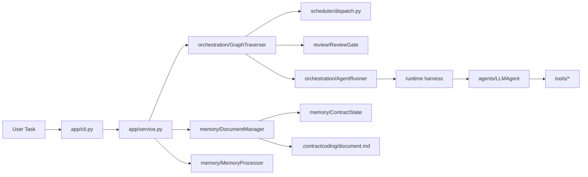
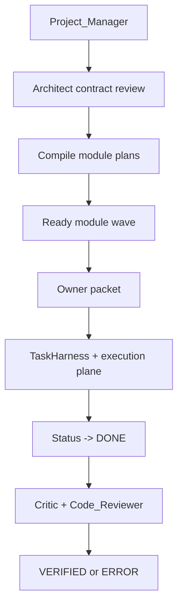

# ContractCoding

ContractCoding is a contract-driven multi-agent coding runtime. It turns a shared project contract into module-team execution waves, runs implementation inside a harnessed execution plane, and uses review gates to decide when work is actually done.

## What It Is

ContractCoding is built around four ideas:

- `ContractState` is the control plane. Agents collaborate through a structured contract, not just chat history.
- `module teams` are the parallel unit. Work is grouped by module, then scheduled by dependency wave.
- `TaskHarness` is the execution boundary. It constrains scope, validates outputs, and manages promotion back into the main workspace.
- `review gates` are quality barriers. `DONE` work is not trusted until review agents turn it into `VERIFIED` or `ERROR`.

## Architecture



The current codebase is organized around these layers:

- `ContractCoding/app/`
  CLI and application service wiring.
- `ContractCoding/agents/`
  Agent classes plus prompt/response helpers and agent capability specs.
- `ContractCoding/memory/`
  Structured contract state, document persistence, and memory processing.
- `ContractCoding/orchestration/`
  Traversal, execution harness, execution planes, and agent running.
- `ContractCoding/review/`
  Review packet construction, review gating, and post-run audits.
- `ContractCoding/scheduler/`
  Dispatch builders for owner packets and scheduler-facing messages.
- `ContractCoding/tools/`
  File, code, search, math, and artifact sidecar tools.
- `ContractCoding/prompts/`
  System and role prompts.

## Execution Flow



In practice, the runtime behaves like this:

1. `Project_Manager` writes the contract.
2. `Architect` validates the contract structure and module graph.
3. The scheduler groups tasks into module teams and dependency waves.
4. Implementation agents execute inside `workspace`, `sandbox`, or `worktree` execution planes.
5. Promotion either applies directly, performs a safe three-way merge, or rejects conflicting changes.
6. Review agents decide whether completed work becomes `VERIFIED` or goes back to `ERROR`.

## Installation

```bash
pip install -r requirements.txt
```

## Run

```bash
python main.py --task "Write a Gomoku program with AI that allows players to play against AI"
```

Useful flags:

- `--workspace`: point tools and execution planes at a specific project workspace
- `--log-path`: write runtime logs to a custom path
- `--max-layers`: cap orchestration depth

## Execution Plane Modes

The runtime supports three execution modes through config:

- `workspace`
  Execute directly in the base workspace.
- `sandbox`
  Copy into an isolated working directory, validate there, then promote.
- `worktree`
  Use a git worktree when possible, while still inheriting dirty workspace state and enforcing safe promotion.

## Extending Agents

The clean extension point is `AgentForge`.

1. Add or update capability specs in `ContractCoding/agents/specs.py`.
2. Add the role prompt in `ContractCoding/prompts/agents_prompt.py`.
3. Let `AgentForge` build the role with the right tool set.

Example:

```python
from ContractCoding.agents.forge import AgentForge
from ContractCoding.agents.specs import AgentCapability
from ContractCoding.config import Config

config = Config()
forge = AgentForge(config)
agent = forge.create_agent(
    "Researcher",
    AgentCapability(FILE=True, SEARCH=True),
)
```

For full runtime wiring, register the agent on the service or engine:

```python
from ContractCoding.app.service import ContractCodingService
from ContractCoding.config import Config

service = ContractCodingService(Config())
service.register_default_agents()
```

## Development

Compile and run the regression suite with:

```bash
python3 -m compileall ContractCoding main.py tests
python3 -m unittest discover -s tests -v
```

## Architecture Docs

- [Current Architecture](docs/current-architecture.md)
- [vNext Execution Plane Design](docs/vnext-execution-plane.md)
