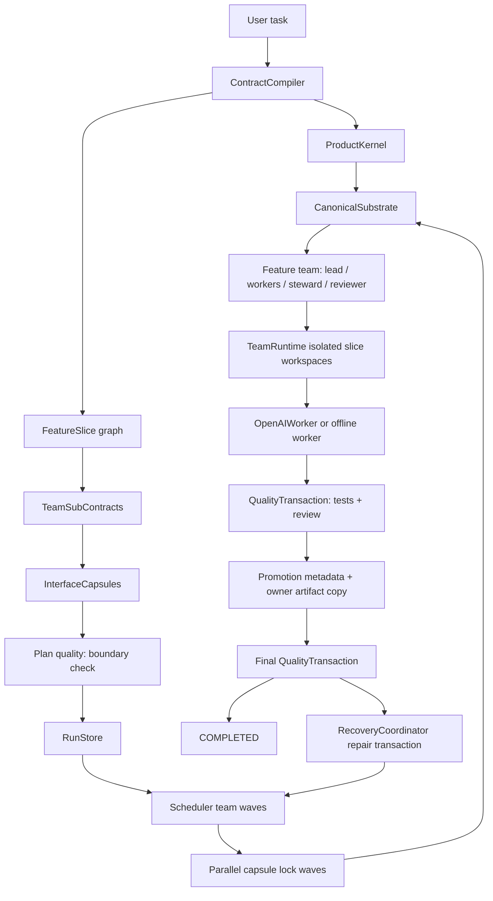

# ContractCoding

ContractCoding is an OpenAI-first long-running agent runtime built around **Product Kernel + Canonical Substrate + Team Subcontract + Interface Capsule + Feature Slice + Quality Transaction + Repair Transaction**.

This branch intentionally removed the old module-team, late-repair Runtime V4 path. The active runtime is `ContractSpec V8 / Runtime V5`: a small durable control plane that freezes product semantics first, sends bounded feature slices to agent teams, promotes only verified owner artifacts, and routes final integration failures into a central repair transaction lane.

## Core Model

- `ProductKernel` is the frozen semantic source of truth: schemas, fixtures, public flows, canonical type ownership, invariants, semantic invariants, public paths, and acceptance matrix.
- `FeatureSlice` is a runnable product slice such as `behavior_engine`, `persistence_flow`, or `public_interface`; it owns artifacts and declares dependencies, fixtures, invariants, interface contract, slice smoke, soft quality signals, and done contract. Large projects are split into finer capability slices so independent domain/core/io/interface work can run in parallel waves.
- `CanonicalSubstrate` names the single owner artifact for shared value objects/enums and forces that substrate to land before dependent slices can consume or extend it.
- `TeamSubContract` is the bounded local contract for a managed team: owned concepts/artifacts, dependency capsule refs, local gates, internal parallel groups, serial edges, agent roles, context policy, and escalation policy.
- `FeatureTeam` groups related slices behind that subcontract and one or more interface capsules.
- `TeamSpec` represents the managed agent team for a feature team: lead, worker pool, interface steward, and reviewer. A team may execute multiple ready slices internally when conflict keys and dependencies allow it.
- `InterfaceCapsule` replaces the old executable-interface path. The compiler creates a compact `INTENT` capsule from product semantics and team boundaries; runtime first runs parallel `capsule` lock items, then implementation work depends on locked capsules. The planner does not have to predesign every class or private API.
- `TeamStateRecord` stores async collaboration state: current phase, locked capsules, waiting capsules, ready items, active items, and mailbox capsule requests.
- Skills and prompt overlays push planning, interface reasoning, code generation, test authoring, and repair judgment into the agent packet; the runtime stays a control plane and fallback layer. Visible Agent-Skills-style files live under `ContractCoding/knowledge/skills/*/SKILL.md`.
- `TeamRuntime` runs each team in an isolated workspace, then sends the patch through a `QualityTransaction`: deterministic tests first, review verdict second, promotion only after both approve. Correctness gates focus on existence, syntax/import, smoke, interface shape, and placeholders; scale/LOC targets are reported as quality signals instead of blocking promotion. Repair items additionally pass exact locked validation before promotion.
- `QualityTransactionRunner` coordinates `SliceJudge`, `IntegrationJudge`, and `RepairJudge` with a deterministic review layer. Review never invents product semantics; it checks whether test evidence is sufficient and whether worker claims respect allowed artifacts, locked tests, required context preflight, kernel-derived acceptance, canonical type ownership, and declared public behavior flows.
- `RecoveryCoordinator` owns final failures as repair transactions, locks tests, detects no-progress fingerprints, and triggers targeted replan or human-required state.

## Flow



## Runtime Artifacts

- `.contractcoding/contract.json`
- `.contractcoding/kernel/product_kernel.json`
- `.contractcoding/kernel/canonical_substrate.json`
- `.contractcoding/slices/<slice-id>.json`
- `.contractcoding/teams/<feature-team-id>.json`
- `.contractcoding/team_subcontracts/subcontract_<feature-team-id>.json`
- `.contractcoding/team_states/<feature-team-id>.json`
- `.contractcoding/interface_capsules/capsule_<feature-team-id>.json`
- `.contractcoding/team_workspaces/<run-id>/<slice-id>/`
- `.contractcoding/quality/<run-id>/<item-id>.json`
- `.contractcoding/promotions/<run-id>/<slice-id>.json`
- `.contractcoding/repairs/<run-id>/<transaction-id>.json`
- `.contractcoding/monitor/<run-id>.json`
- `.contractcoding/evals/<suite-id>.json`

## CLI

```bash
python main.py --workspace /tmp/cc-demo run "Build package named atlas_ops with atlas_ops/__init__.py atlas_ops/core/engine.py tests/test_integration.py" --max-steps 20
python main.py --workspace /tmp/cc-demo monitor <run_id> --json
python main.py --workspace /tmp/cc-demo eval --suite large --max-steps 80
```

Use `--offline` for deterministic local runtime tests. Eval defaults to offline unless `RUN_OPENAI_E2E=1` is set.

OpenAI-compatible configuration:

```bash
API_KEY=... BASE_URL=https://api.openai.com/v1 MODEL_NAME=gpt-5.4-2026-03-05 python main.py run "build the feature"
```

Credentials are read from environment variables and are not rendered into monitor, status, eval, or report output.

## Current Modules

- `ContractCoding/contract/`: Product Kernel, Feature Slice, teams, promotions, replans, telemetry, compiler, and artifact store.
- `ContractCoding/runtime/`: durable run store, scheduler, team runtime, engine, monitor, recovery coordinator, worker, and patch guard.
- `ContractCoding/quality/`: quality transactions, finalization coordinator, slice/integration/repair judges, semantic lint, and eval suites.
- `ContractCoding/knowledge/`: progressive-disclosure built-in skills plus visible `SKILL.md` files for planning, code generation, test/review, repair, and tool use.
- `ContractCoding/knowledge/prompting.py`: worker prompt overlays and packets that provide only the team subcontract, current slice, direct dependency capsules, canonical substrate, and required preflight tools.
- `ContractCoding/tools/` and `ContractCoding/llm/`: retained OpenAI native tool-call path and governed tools. Tool catalog includes filesystem tools, `contract_snapshot`, `inspect_module_api`, `run_public_flow`, `run_code`, web search, and math.

## Development

```bash
python3 -m compileall ContractCoding main.py tests
python3 -m unittest discover -s tests -v
python3 main.py --workspace /tmp/cc-v5-large --offline eval --suite large --max-steps 80
```
