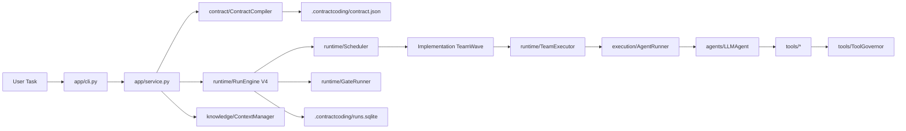
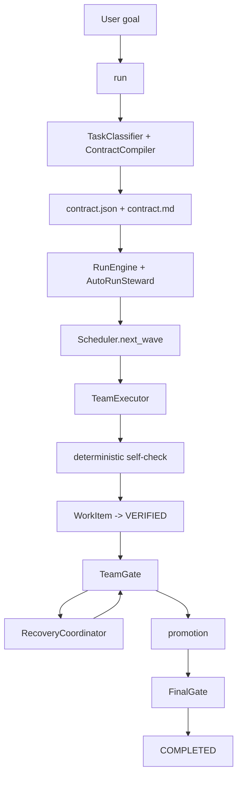

# ContractCoding

ContractCoding is an OpenAI-first, contract-first long-running agent runtime. It compiles a canonical contract into scope-based team waves, runs serial and parallel work with durable state, and keeps all LLM tool use behind ContractCoding's permission gate.

## What It Is

ContractCoding is built around four ideas:

- `ContractSpec V8` is the scheduling source of truth. `.contractcoding/contract.json` is canonical; Markdown is only a rendered view.
- `WorkScope` is the functional team boundary. Coding scopes are domains like `domain`, `core`, `ai`, `io`, and `interface`; research, docs, ops, and data get their own scope types.
- `WorkItem` is only production work. Tests, review, team acceptance, and final acceptance are first-class gates, not fake WorkItems.
- `TeamGate` and `FinalGate` define quality boundaries. Each item gets a deterministic self-check; each team gets one gate; the project gets one final gate.
- `Scheduler` produces ready `TeamWave`s. Independent scopes and independent items run in parallel; shared conflict keys and serial groups stay serial.
- `RunStore` records runtime facts only: run state, contract versions, leases, team runs, gate status, steps, events, and evidence.

## Architecture



The current codebase is organized around these layers:

- `ContractCoding/app/`
  CLI and application service wiring.
- `ContractCoding/agents/`
  Agent classes, profile/capability registry, Runtime V4 prompts, and response parsing.
- `ContractCoding/knowledge/`
  Agent input packets, memory summaries, contract slicing, and built-in MVP skills for coding, research, math, paper writing, data, ops, and general delivery.
- `ContractCoding/contract/`
  ContractSpec V8 schema, compiler, file store, and Markdown renderer.
- `ContractCoding/execution/`
  Execution harness, execution planes, workspace routing, and agent running.
- `ContractCoding/runtime/`
  Durable run store, evidence ledger, scheduler, gate runner, autonomous steward, resumable run engine, and team executor.
- `ContractCoding/quality/`
  Self-checks, team/final deterministic gates, gate review parsing, failure routing, and eval helpers.
- `ContractCoding/tools/`
  File, code, search, math, and artifact sidecar tools.

## Execution Flow



In practice, the runtime behaves like this:

1. `run "<task>"` classifies the task, compiles a ContractSpec V8 contract, and writes `.contractcoding/contract.json`.
2. `RunEngine` records a contract version in `.contractcoding/runs.sqlite`; `AutoRunSteward` drives resume loops.
3. `Scheduler.next_wave()` selects ready team waves from dependencies, leases, conflict keys, serial groups, and resource limits.
4. `TeamExecutor` runs each wave serially or in parallel, recording steps and evidence.
5. Each completed item runs an implicit self-check and becomes `VERIFIED` only after deterministic checks pass.
6. Once a team’s items are verified, `GateRunner` runs that team’s tests/review/gate; failures become diagnostics for `RecoveryCoordinator`.
7. The run completes only after every required team is promoted and the final gate passes.

## Installation

```bash
pip install -r requirements.txt
```

## Run

```bash
API_KEY=... BASE_URL=... API_VERSION=... python main.py run "Write a Gomoku program with AI that allows players to play against AI" --backend openai
```

Useful flags:

- `--workspace`: point tools and execution planes at a specific project workspace
- `--log-path`: write runtime logs to a custom path
- `--max-steps`: pause after a bounded number of implementation/gate steps

The user-facing CLI is intentionally small:

```bash
python main.py status <task_id_or_run_id>
python main.py events <task_id_or_run_id> --human
python main.py events <task_id_or_run_id> --json
```

Compiled contracts are stored under `.contractcoding/contract.json` and `.contractcoding/contract.md`. Run state is stored under `.contractcoding/runs.sqlite`, including contract versions, leases, team runs, steps, events, and evidence.

## LLM Backends

The default and primary backend is the OpenAI-compatible API. Configure it with `API_KEY`, `BASE_URL`, `API_VERSION`, and optionally `MODEL_NAME` or `OPENAI_DEPLOYMENT_NAME`:

```bash
API_KEY=... BASE_URL=https://api.openai.com/v1 MODEL_NAME=gpt-5.4-2026-03-05 python main.py run "build the feature"
```

The runtime uses OpenAI native tool calls, then executes every tool through ContractCoding's `ToolGovernor`, scoped file tools, self-checks, team gates, and final gates. API keys and endpoints are read from environment variables and are never rendered into reports.

Runtime reports use backend-neutral `llm_observability` for token, tool, retry, and failure summaries.

## Context And Skills

The `knowledge` layer is the input-control layer for long-running work. It keeps per-agent history, compresses older turns into summaries, slices the compiled contract into `AgentInputPacket`s, limits message size with `CONTEXT_MAX_CHARS`, and injects matching skills into each LLM step.

Built-in MVP skills are enabled by default:

- `general.delivery`
- `coding.implementation`
- `research.synthesis`
- `math.reasoning`
- `paper.writing`
- `data.pipeline`
- `ops.safety`
- `eval.bench`

Disable them with `ENABLE_BUILTIN_SKILLS=false` when testing a minimal custom skill set.

Skills can be loaded from Markdown files or directories:

```bash
SKILL_PATHS="./my-skills/python/SKILL.md,./my-skills/research" python main.py run "build the feature"
```

A skill may include `allowed_work_kinds: coding,doc,research` to scope it to specific `WorkItem.kind` values. If omitted, it applies to all work kinds.

## Prompt Layers

The system prompt lives in `ContractCoding/agents/prompts.py`.

ContractCoding intentionally uses one core system prompt with runtime overlays instead of many unrelated system prompts:

- Core prompt: contract-first behavior, tool policy, evidence expectations, and output format.
- Phase overlay: control plane, team execution, verification, or integration.
- Profile prompt: role-specific behavior from `AgentProfile`.
- Skill context: task-type guidance selected by the knowledge layer.

This keeps the hierarchy stable while still adapting prompts for main-chain planning, team execution, and team verification.

## Execution Plane Modes

The runtime supports three execution modes through config:

- `workspace`
  Execute directly in the base workspace.
- `sandbox`
  Copy into an isolated working directory, validate there, then promote.
- `worktree`
  Use a git worktree when possible, while still inheriting dirty workspace state and enforcing safe promotion.

## Extending Agents

The clean extension point is `AgentForge`.

1. Add or update capability/profile metadata in `ContractCoding/agents/profile.py`.
2. Add the role prompt in `ContractCoding/agents/prompts.py`.
3. Let `AgentForge` build the role with the right tool set.

Example:

```python
from ContractCoding.agents.forge import AgentForge
from ContractCoding.agents.profile import AgentCapability
from ContractCoding.config import Config

config = Config()
forge = AgentForge(config)
agent = forge.create_agent(
    "Researcher",
    AgentCapability(FILE=True, SEARCH=True),
)
```

For full runtime wiring, register the agent on the service or engine:

```python
from ContractCoding.app.service import ContractCodingService
from ContractCoding.config import Config

service = ContractCodingService(Config())
service.register_default_agents()
```

## Development

Compile and run the regression suite with:

```bash
python3 -m compileall ContractCoding main.py tests
python3 -m unittest discover -s tests -v
```

## Architecture Docs

- [Current Architecture](docs/current-architecture.md)
- [vNext Execution Plane Design](docs/vnext-execution-plane.md)
