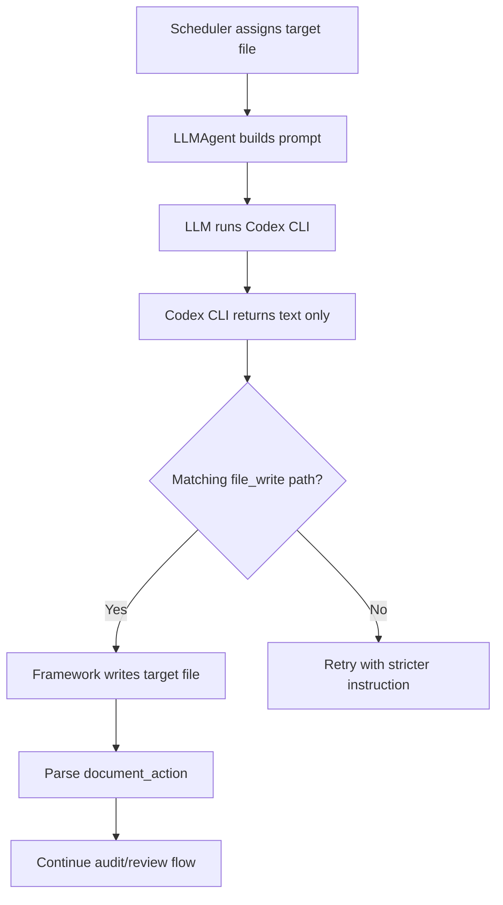

# Codex CLI Backend Design

## 1. Background

This change adds a new model backend for ContractCoding: `codex_cli`.

Before this change, agents mainly used the OpenAI-compatible chat API as the model backend. Implementation agents could receive file tools and let the model call write operations directly. That is convenient, but it gives the model backend write authority inside the generated workspace.

The new backend lets users run Codex CLI as the model provider while keeping Codex CLI read-only. Codex CLI returns generated code as text, and ContractCoding decides whether and where to write that code.

This is especially useful on Windows, where Codex CLI may be installed as `codex.exe` or through a terminal alias, and the exact command path can vary by machine.

## 2. Goals

The feature has four main goals:

- Use Codex CLI as an alternative backend to the OpenAI chat API.
- Keep Codex CLI in read-only mode so it cannot directly modify project files.
- Avoid arbitrary file writes by only accepting code for the scheduler-selected target file.
- Preserve the existing multi-agent flow, collaborative document protocol, and implementation-review loop.

## 3. Non-Goals

This change does not introduce a new UI, does not replace the Contract Kernel, and does not redesign the full agent protocol.

It also does not make Codex CLI a native tool-calling backend. In `codex_cli` mode, tool calling is intentionally disabled for the model backend.

## 4. Configuration

The new backend is controlled by environment variables defined in `ContractCoding/config.py`.

| Variable | Default | Description |
| --- | --- | --- |
| `MODEL_BACKEND` | `openai` | Backend selector. Use `codex_cli` to enable Codex CLI. |
| `CODEX_CLI_COMMAND` | `codex exec --sandbox read-only --ask-for-approval never -` | Command used to invoke Codex CLI. |
| `CODEX_CLI_WORKDIR` | `.` | Working directory for the Codex CLI process. |
| `CODEX_CLI_TIMEOUT` | `300` | Timeout in seconds for a Codex CLI call. |
| `CODEX_CLI_MAX_OUTPUT_CHARS` | `200000` | Maximum accepted stdout length before truncation. |
| `CODEX_CLI_READ_ONLY` | `true` | Enables read-only safety checks and warnings. |

Example PowerShell setup:

```powershell
$env:MODEL_BACKEND = "codex_cli"
$env:CODEX_CLI_COMMAND = 'codex exec --sandbox read-only --ask-for-approval never -'
$env:CODEX_CLI_WORKDIR = "."
$env:CODEX_CLI_TIMEOUT = "300"
$env:CODEX_CLI_READ_ONLY = "true"
python main.py --task "Your task description"
```

If Windows cannot resolve the `codex` command, configure an explicit executable path:

```powershell
$env:CODEX_CLI_COMMAND = '"C:\\path\\to\\codex.exe" exec --sandbox read-only --ask-for-approval never -'
```

## 5. Main Code Changes

### 5.1 `ContractCoding/config.py`

Added backend configuration fields and a boolean environment parser.

The project can now switch model backends without changing code:

- `MODEL_BACKEND=openai` keeps the original OpenAI-compatible behavior.
- `MODEL_BACKEND=codex_cli` uses the new Codex CLI backend.

### 5.2 `ContractCoding/llm/client.py`

The `LLM` class now supports two backend modes.

For `openai`:

- Behavior remains compatible with the previous chat API path.
- OpenAI client initialization is lazy and only happens when this backend is selected.

For `codex_cli`:

- Messages are converted into a single text prompt.
- The prompt explicitly tells Codex CLI not to write, edit, delete, or move files.
- The subprocess is launched with the configured command.
- stdout is returned as the model response.
- stderr is logged.
- non-zero exit codes raise a runtime error.
- long outputs are truncated according to `CODEX_CLI_MAX_OUTPUT_CHARS`.

The backend also warns if `CODEX_CLI_READ_ONLY=true` but the configured command does not visibly contain a read-only sandbox flag.

### 5.3 `ContractCoding/agents/base.py`

Agent construction now passes backend settings into `LLM`.

This keeps the backend choice centralized in `Config`, while each agent continues using `self.llm.chat(...)` or `self.llm.chat_with_tools(...)` as before.

### 5.4 `ContractCoding/agents/agent.py`

This is the key safety integration.

When the backend is `codex_cli` and the current agent is an implementation agent, the agent receives an additional system instruction:

- Codex CLI is read-only.
- It must not call `write_file`.
- It must return the full generated code inside a `<file_write path="...">...</file_write>` block.
- The path must match the scheduler-selected target file.

The framework then parses the response and materializes code through `WorkspaceFS.write_file(...)`.

Only the scheduler-selected `target_file` is writable. If Codex CLI returns another path, that file is ignored.

Accepted response format:

````text
<file_write path="service.py">
```python
def run() -> bool:
    return True
```
</file_write>
````

The parser also supports a single fenced code block as a fallback when there is only one unambiguous target file.

## 6. Execution Flow

The new flow for an implementation task is:

1. Scheduler assigns a concrete task, for example `Implement/Fix service.py`.
2. `LLMAgent` extracts `service.py` as the target file.
3. The agent calls `LLM` using `MODEL_BACKEND=codex_cli`.
4. `LLM` runs Codex CLI as a subprocess using `CODEX_CLI_COMMAND`.
5. Codex CLI reads context and returns generated code as text.
6. `LLMAgent` extracts a matching `<file_write path="service.py">` block.
7. ContractCoding writes `service.py` through `WorkspaceFS`.
8. The normal document action, audit, critic, and reviewer flow continues.



## 7. Security Boundary

The main security idea is separation of authority.

Codex CLI has read authority only. It can inspect context and propose code, but it should not directly mutate the workspace.

ContractCoding keeps write authority. It validates the target path and performs the write itself.

The current protection rules are:

- Native tool calling is disabled in `codex_cli` mode.
- Codex CLI is instructed to use a read-only sandbox.
- The default command includes `--sandbox read-only` and `--ask-for-approval never`.
- The framework only writes the current scheduler-selected target file.
- Additional returned file paths are ignored.
- Workspace path resolution still goes through `WorkspaceFS`, which blocks parent-directory traversal.

This does not make the generated code automatically safe to execute. It only prevents the model backend from directly writing arbitrary files during generation.

## 8. Failure and Retry Behavior

If the implementation agent is expected to create or update a target file but no file appears, the agent retries up to three times.

In `codex_cli` mode, the retry message explicitly asks for:

```text
<file_write path="target.py">...</file_write>
```

If Codex CLI returns malformed output, the framework does not write arbitrary content. It asks again with a stricter instruction.

## 9. Tests Added

The new test file is `tests/test_codex_cli_backend.py`.

It verifies that:

- Codex CLI prompts include read-only instructions.
- The prompt describes the `<file_write>` contract.
- The parser only accepts a matching target path.
- The framework writes only the scheduler-selected file.
- Arbitrary returned paths are ignored.
- Single fenced code block fallback works for unambiguous target-file tasks.

Existing contract kernel and audit tests were also rerun to ensure no regression.

## 10. Verification

The following checks passed on Windows using the bundled Python runtime:

```powershell
python -m unittest tests.test_contract_kernel_and_audit tests.test_codex_cli_backend
python -m compileall ContractCoding tests
```

Result:

- 8 unit tests passed.
- Python compilation completed successfully.
- One pre-existing logger `ResourceWarning` appeared during tests, but it did not fail the suite and was not introduced by this feature.

## 11. Remaining Limitations

- Codex CLI command-line flags were made configurable because Windows installations differ.
- The framework does not currently verify the installed Codex CLI version or exact flag support.
- `codex_cli` mode does not support image inputs.
- `codex_cli` mode does not support native structured tool calls.
- Generated code still needs the existing AST audit, critic, and reviewer stages to catch interface and implementation problems.

## 12. Summary

This change adds a safer model-backend option for ContractCoding.

Instead of giving the model backend direct file write access, Codex CLI is treated as a read-only code generator. It returns code in a structured text envelope, and ContractCoding performs the actual write only when the path matches the scheduler-selected target file.

This keeps the multi-agent workflow intact while reducing the risk of arbitrary file modifications from the model backend.
