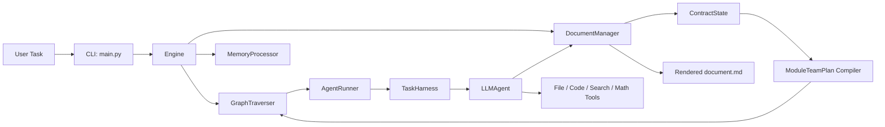
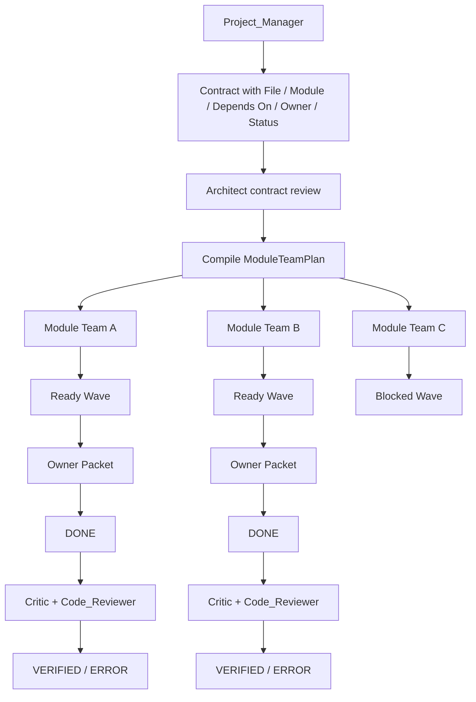

# Current Architecture

ContractCoding currently operates as a contract-driven multi-agent orchestration system with three core layers:

1. `ContractState` as the structured source of truth.
2. `GraphTraverser` as the module-team scheduler.
3. `TaskHarness` as the execution guardrail around every agent run.

The important shift from the older version is that orchestration is no longer purely file-flat and no longer relies on raw Markdown patching as the only state model. The system now compiles the collaborative document into structured task blocks and schedules work by module team and dependency wave.

## System Overview

## Scheduling Model

Each file block in `Symbolic API Specifications` now includes:

- `File`
- `Module`
- `Depends On`
- `Owner`
- `Version`
- `Status`

These fields are parsed into `TaskBlock` and compiled into `ModuleTeamPlan`. A module team is the unit of parallelism. Inside each module, dependencies are used to compute the current ready wave.

## Harness Model

The harness now wraps implementation agents with:

- target file detection
- module-aware ownership scope
- placeholder rejection
- contract status advancement checks
- isolated execution plane support

This means the scheduler decides what should run, while the harness decides whether the execution respected the contract.

## Current Execution Planes

The current codebase supports three execution modes:

- `workspace`
  Direct execution in the base workspace. This is the current safe default.
- `sandbox`
  A disposable copied workspace for implementation tasks. Validated changes are promoted back.
- `worktree`
  A git worktree-backed isolated execution plane when the target workspace is inside a git repository. If worktree creation fails, the runtime can fall back to `sandbox`.

## Why This Matters

This architecture gives the project four properties that the original version did not reliably provide:

1. Parallelism with structure.
2. Shared-state safety.
3. Execution validation.
4. Clear boundaries for future isolation and promotion workflows.
