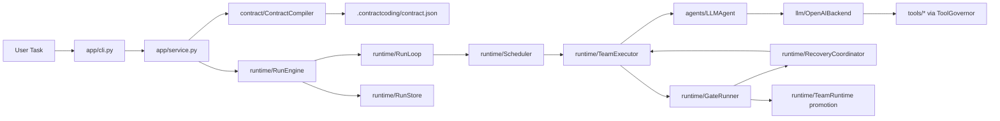

# Current Architecture

ContractCoding is currently an OpenAI-first, contract-driven long-running runtime built around **ContractSpec V8 + Runtime V4**. The OpenAI API is the only supported LLM path.

## System Overview

## Runtime Model

- `ContractSpec V8` is the plan source of truth: work scopes, work items, interfaces, team gates, final gate, execution policy, and recovery guardrails.
- `RunStore` persists runtime facts only: task/run status, contract versions, leases, team workspaces, steps, events, gates, evidence, and repair tickets.
- `Scheduler` produces ready team waves from dependency, phase, conflict-key, lease, and parallelism policy.
- `TeamExecutor` runs scoped work items in the active team workspace and records backend-neutral `llm_observability`.
- `GateRunner` performs deterministic team/final checks and emits structured diagnostics.
- `RecoveryCoordinator` owns global review/repair decisions, opens auditable repair plans, and reopens only targeted owner work.
- `TeamRuntime` owns durable scope teams, isolated workspaces, dependency refresh, and promotion after local verification.

## OpenAI-First Backend Policy

The default backend is `openai`. It uses native tool calls, but all tools still execute through ContractCoding's policy layer:

- `ToolGovernor` restricts writes to the work item's allowed artifacts and conflict keys.
- `PatchGuard` can roll back invalid repair writes before they pollute the workspace.
- Self-checks, team gates, and final gates decide completion; LLM claims are advisory.
- API credentials are read from `API_KEY`, `BASE_URL`, and `API_VERSION` and are not logged or rendered.

Runtime control flow does not run backend-specific probes. Provider facts are recorded only through backend-neutral `llm_observability`.

## Long-Running Guarantees

The current implementation is optimized for resumable work rather than a single endless model context:

1. Durable contract and run ledgers survive process restarts.
2. Stale running items and gates are recovered before new dispatch.
3. Parallel teams operate through scoped leases and conflict keys.
4. Isolated workspaces can be promoted only after deterministic gates pass.
5. Reports summarize phase, artifact coverage, team state, gate state, repair tickets, timing, and backend-neutral LLM telemetry.
