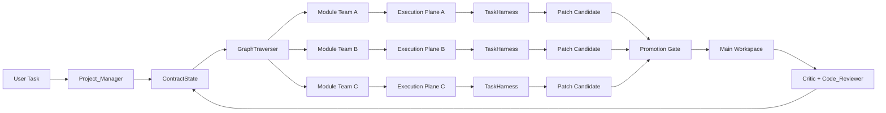
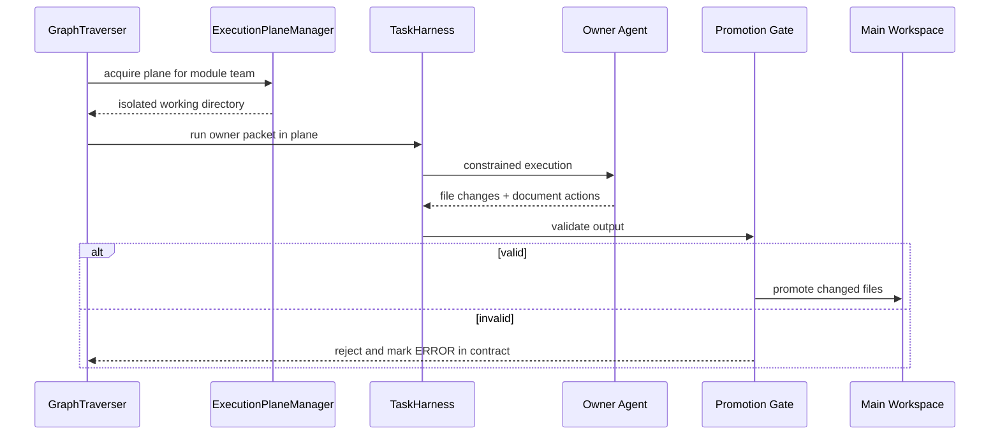

# vNext: Module-Team Execution Planes

This document defines the full target design for the next evolution of ContractCoding:

**module-team orchestration + isolated execution planes + controlled promotion**

The goal is to make the system behave more like a high-quality agent team runtime, while preserving contract correctness and auditability.

## Design Goal

The current system already knows how to:

- plan by module
- schedule by dependency wave
- group ready tasks by owner
- validate execution with a harness

The missing piece is execution isolation. Today, implementation still writes into a shared workspace unless an isolated plane is enabled. vNext turns execution isolation into a first-class runtime capability.

## Target Architecture

## Core Principles

1. Many teams can execute in parallel.
2. Only one owner can modify a protected contract shard at a time.
3. Isolated execution planes are disposable.
4. The base workspace is not the first write target for implementation.
5. Promotion is explicit and validated.

## Terminology

### Module Team

The scheduling shard. A module team contains the files that share the same `Module` field in the contract.

### Ready Wave

The set of files inside a module whose `Depends On` edges are currently satisfied.

### Owner Packet

The unit of agent execution. Files in the same module and ready wave are grouped by owner and executed together.

### Execution Plane

A temporary isolated working directory used during implementation. Supported plane types:

- `workspace`
- `sandbox`
- `worktree`

### Promotion Gate

The point where isolated outputs are checked and copied back into the base workspace.

## Full Runtime Flow

## Execution Plane Strategy

### Workspace

Used for:

- non-implementation roles
- compatibility mode
- environments where isolation is disabled

### Sandbox

Used when:

- isolation is required
- the target workspace is not a git repository
- worktree creation fails and fallback is enabled

Sandbox planes are full copies of the target workspace and are easy to reason about. They are slower than worktrees but much more portable.

### Worktree

Used when:

- the target workspace sits inside a git repository
- the runtime is configured to prefer worktrees

Worktree planes provide a closer model to tools like Claude Code because each team gets a repository-backed isolated checkout.

## Promotion Rules

Promotion should remain conservative. A candidate can be promoted only if:

1. It only modifies files inside the allowed owner scope.
2. Required target files were created or updated.
3. No placeholder code remains.
4. Contract status was advanced correctly.
5. No contract shard conflicts were introduced.

In the full version, promotion should also become diff-aware, not only copy-aware.

## Full vNext Components

The complete target system should contain these modules:

### `ExecutionPlaneManager`

Responsibilities:

- create execution planes
- choose worktree or sandbox
- clean up temporary planes
- provide runtime workspace paths

### `WorkspaceContext`

Responsibilities:

- route tools and file system access to the active execution plane
- keep tool APIs stable while allowing per-run workspace overrides

### `PatchCollector`

Responsibilities:

- capture changed files
- compute patch metadata
- record touched contract shards
- surface promotion candidates

### `PromotionGate`

Responsibilities:

- validate candidate outputs
- resolve allowed file scope
- promote safe changes to the base workspace
- reject invalid planes without polluting the base workspace

### `Run Ledger`

Responsibilities:

- persist execution-plane runs
- record module, owner, wave, changed files, validation results, and promotion decisions
- provide replay and debugging visibility

## Planned Follow-Up Enhancements

The current implementation adds the execution plane abstraction and runtime workspace routing. The full version should continue with:

1. diff-based promotion instead of file-copy promotion
2. explicit lease management for module ownership
3. worktree reuse across waves in the same module
4. structured run ledger persistence
5. reviewer-side plane inspection before promotion for selected workflows

## Why This Is The Right Direction

This design keeps the best properties of the current system:

- contract-driven orchestration
- module-level parallelism
- harness-based correctness
- structured review barriers

While adding the missing property:

- isolated execution like a real agent team runtime

That makes vNext more parallel, safer under concurrency, and easier to evolve toward a production-quality multi-agent coding system.
