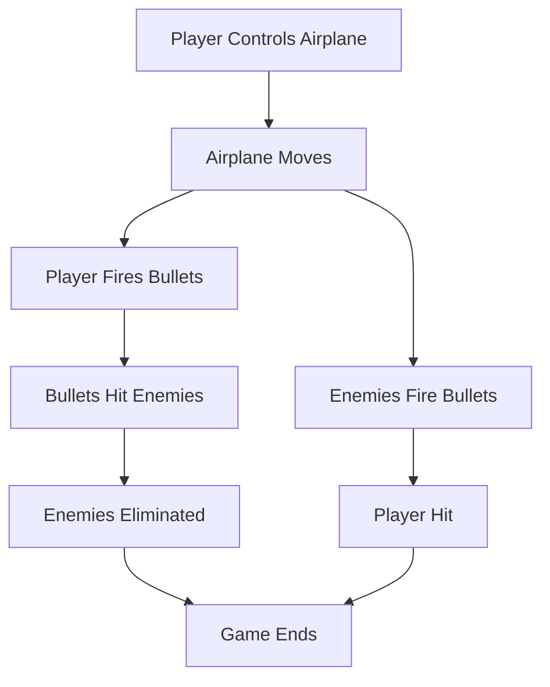
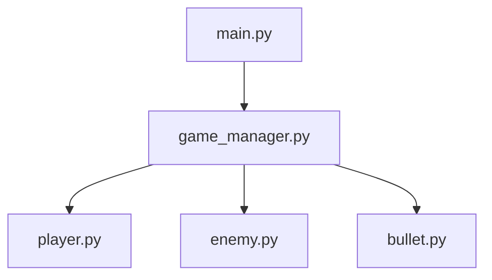

## Requirements Document

### Problem Statement
The goal is to develop a flying battle game where players control an airplane that can move in four directions (up, down, left, right) and fire bullets. The game involves eliminating enemies by shooting them while avoiding enemy bullets. The game ends when all enemies are eliminated or the player's airplane is hit and destroyed.

### Assumptions & Constraints
- The game will be implemented in Python using the Pygame library.
- The game will have a 2D graphical interface.
- The player can control the airplane using keyboard inputs.
- Enemies will move and fire bullets autonomously.
- Collision detection will determine when bullets hit airplanes.
- The game will have a single-player mode.

### Content and Interaction Logic
- The player controls an airplane that can move in four directions.
- The player can fire bullets to eliminate enemies.
- Enemies move and fire bullets at the player.
- The game ends when all enemies are eliminated or the player's airplane is hit.

### Agents and Responsibilities
- **Project Manager**: Define the project structure, requirements, and technical details.
- **Backend Engineer**: Implement game logic, including movement, collision detection, and game state management.
- **Frontend Engineer**: Develop the graphical interface and handle user input.
- **Algorithm Engineer**: Design and implement algorithms for enemy movement and bullet firing.
- **Code Reviewer**: Ensure the implementation aligns with the collaborative document and is free of errors.

### Non-Functional Requirements
- Performance: The game should run smoothly at 60 frames per second.
- Reliability: The game should handle edge cases, such as simultaneous collisions.
- Accessibility: The game should be easy to play with clear instructions.
- Observability: The game should log key events, such as collisions and game state changes.

### User Stories & Acceptance Criteria
1. **Player Movement**:
   - As a player, I want to move my airplane in four directions using the keyboard.
   - Acceptance Criteria: The airplane moves smoothly in response to arrow key inputs.

2. **Shooting Bullets**:
   - As a player, I want to shoot bullets to eliminate enemies.
   - Acceptance Criteria: Bullets are fired in the direction the airplane is facing and can hit enemies.

3. **Enemy Behavior**:
   - As a player, I want enemies to move and fire bullets autonomously.
   - Acceptance Criteria: Enemies move and fire bullets at the player.

4. **Game Over**:
   - As a player, I want the game to end when all enemies are eliminated or my airplane is hit.
   - Acceptance Criteria: The game displays a "Game Over" screen when the game ends.

### Success Metrics
- Functional: The game meets all acceptance criteria.
- Non-Functional: The game runs smoothly and is free of critical bugs.

### Core Process


## Technical Document

### Architecture Overview
- Language: Python
- Framework: Pygame
- Libraries: None (standard Pygame functionality will be used)

### Project Structure
```
workspace/
├── main.py
├── game/
│   ├── __init__.py
│   ├── player.py
│   ├── enemy.py
│   ├── bullet.py
│   ├── game_manager.py
├── assets/
│   ├── images/
│   ├── sounds/
```

### Dependency Relationships


### File-Based Sub-Tasks
#### main.py
- **Path**: `main.py`
- **Structure**:
  - **Functions**:
    - `main() -> None`: Initializes the game and starts the main game loop.
- **Owner**: Backend Engineer
- **Status**: DONE

- **Version**: 2

#### game/player.py
- **Path**: `game/player.py`
- **Structure**:
  - **Classes**:
    - `Player`:
      - **Attributes**:
        - `x: int`
        - `y: int`
        - `speed: int`
      - **Methods**:
        - `move(direction: str) -> None`: Moves the player in the specified direction.
        - `fire_bullet() -> Bullet`: Fires a bullet.
- **Owner**: Frontend Engineer

- **Status**: DONE
- **Version**: 2

#### game/enemy.py
- **Path**: `game/enemy.py`
- **Structure**:
  - **Classes**:
    - `Enemy`:
      - **Attributes**:
        - `x: int`
        - `y: int`
        - `speed: int`
      - **Methods**:
        - `move() -> None`: Moves the enemy.
        - `fire_bullet() -> Bullet`: Fires a bullet.
- **Owner**: Algorithm Engineer
- **Status**: DONE
- **Version**: 3

#### game/bullet.py
- **Path**: `game/bullet.py`
- **Structure**:
  - **Classes**:
    - `Bullet`:
      - **Attributes**:
        - `x: int`
        - `y: int`
        - `speed: int`
      - **Methods**:
        - `move() -> None`: Moves the bullet.
- **Owner**: Algorithm Engineer
- **Status**: DONE
- **Version**: 3

#### game/game_manager.py
- **Path**: `game/game_manager.py`
- **Structure**:
  - **Classes**:
    - `GameManager`:
      - **Attributes**:
        - `player: Player`
        - `enemies: List[Enemy]`
        - `bullets: List[Bullet]`
      - **Methods**:
        - `run_game_loop() -> None`: Runs the main game loop.
        - `check_collisions() -> None`: Checks for collisions between bullets and airplanes.
        - `end_game() -> None`: Ends the game.
- **Owner**: Backend Engineer

- **Status**: ERROR
- **Version**: 2

### Linkage Between Frontend and Backend
- The frontend (Pygame) will handle rendering and user input.
- The backend will handle game logic and state management.
- The `GameManager` class will act as the central controller, coordinating interactions between the player, enemies, and bullets.

### Project Entry Program
- **File**: `main.py`
- **Function**: `main()`
- **Logic**:
  1. Initialize Pygame and create a game window.
  2. Create an instance of `GameManager`.
  3. Call `GameManager.run_game_loop()` to start the game.

### Configuration
- Screen dimensions: `800x600`
- Player speed: `5`
- Enemy speed: `3`
- Bullet speed: `10`