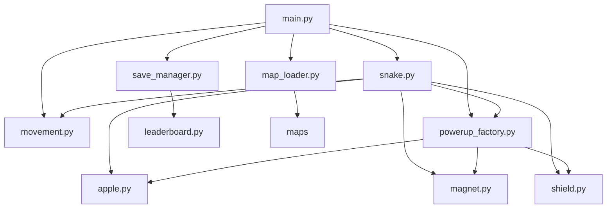

## Product Requirement Document (PRD)

### 1.1 Project Overview
The "Snake Grand-Master" project aims to develop a highly extensible Snake game using Python and Pygame. The game will feature advanced movement mechanics, a modular power-up system, configurable levels, and a leaderboard with persistent storage. The project emphasizes modularity, extensibility, and clean architecture.

### 1.2 User Stories (Features)
* **Advanced Movement:** Implement standard snake growth logic with support for "Speed Boost" and "Teleportation Walls."
* **Power-up Factory:** A modular system to spawn different items (Apple for growth, Magnet for distance, Shield for wall-clip).
* **Level/Map System:** Load different arena layouts (e.g., Box, Tunnel, Maze) from external configuration files.
* **Leaderboard & Save System:** Handle high-score persistence and rank calculation.

### 1.3 Constraints
* **Tech Stack:** Python, Pygame
* **Standards:** PEP8 compliance, modular architecture
* **Repository Structure:** Must contain at least 13 files.
* **Language Contract:** Separate the Item Factory, Map Loader, and Save System. The Snake Entity should only interact with items through a generic "Effect Interface."

## Technical Architecture Document (System Design)

### 2.1 Directory Structure
```
workspace/
├── core/
│   ├── snake.py
│   ├── movement.py
│   ├── powerups/
│   │   ├── powerup_factory.py
│   │   ├── apple.py
│   │   ├── magnet.py
│   │   └── shield.py
│   ├── map_loader.py
│   ├── maps/
│   │   ├── box_map.json
│   │   ├── tunnel_map.json
│   │   └── maze_map.json
├── save_system/
│   ├── save_manager.py
│   └── leaderboard.py
├── main.py
└── config.py
```

### 2.2 Global Shared Knowledge
* **CONSTANTS:**
  * `SNAKE_INITIAL_SPEED: float` - Default speed of the snake.
  * `POWERUP_SPAWN_INTERVAL: int` - Interval in seconds for spawning power-ups.
  * `MAP_DIRECTORY: str` - Directory path for map configuration files.
  * `SAVE_FILE_PATH: str` - Path to the save file for leaderboard.

### 2.3 Dependency Relationships(MUST):


### 2.4 Symbolic API Specifications
**File:** `core/snake.py`
* **Class:** `Snake`
    * **Attributes:**
        * `body: List[Tuple[int, int]]` - List of (x, y) coordinates representing the snake's body.
        * `direction: Tuple[int, int]` - Current direction of the snake.
        * `speed: float` - Movement speed of the snake.
    * **Methods:**
        * `def move(self) -> None:` 
            + Docstring: Updates the snake's position based on its direction and speed.
        * `def grow(self) -> None:`
            + Docstring: Increases the length of the snake by one segment.
        * `def check_collision(self, walls: List[Tuple[int, int]]) -> bool:`
            + Docstring: Checks if the snake has collided with itself or the walls.
        * `def apply_effect(self, effect: 'EffectInterface') -> None:`
            + Docstring: Applies the effect of a power-up to the snake.
    * **Owner:** Backend_Engineer
    * **Version:** 3
    * **Status:** VERIFIED

**File:** `core/movement.py`
* **Class:** `Movement`
    * **Methods:**
        * `def change_direction(self, current_direction: Tuple[int, int], new_direction: Tuple[int, int]) -> Tuple[int, int]:`
            + Docstring: Changes the snake's direction, ensuring it does not reverse.
    * **Owner:** Backend_Engineer
    * **Version:** 2
    * **Status:** VERIFIED

**File:** `core/powerups/powerup_factory.py`
* **Class:** `PowerUpFactory`
    * **Methods:**
        * `def create_powerup(self, powerup_type: str, position: Tuple[int, int]) -> 'EffectInterface':`
            + Docstring: Creates a power-up object based on the specified type and position.
            + Args:
                - `powerup_type (str)`: Type of power-up to create. Valid types are 'apple', 'magnet', and 'shield'.
                - `position (Tuple[int, int])`: The position where the power-up will be placed.
            + Returns:
                - `EffectInterface`: An instance of the specified power-up.
            + Raises:
                - `ValueError`: If the power-up type is unsupported.
    * **Owner:** Backend_Engineer
    * **Version:** 3
    * **Status:** DONE

**File:** `core/powerups/apple.py`
* **Class:** `Apple`
    * **Attributes:**
        * `position: Tuple[int, int]` - The (x, y) coordinates where the apple is located.
    * **Methods:**
        * `def __init__(self, position: Tuple[int, int]):`
            + Docstring: Initializes an Apple object with its position.
        * `def apply(self, snake: 'Snake') -> None:`
            + Docstring: Applies the growth effect to the snake.
    * **Owner:** Backend_Engineer
    * **Version:** 4
    * **Status:** VERIFIED

**File:** `core/powerups/magnet.py`
* **Class:** `Magnet`
    * **Methods:**
        * `def apply(self, snake: 'Snake') -> None:`
            + Docstring: Pulls nearby power-ups towards the snake.
* **Owner:** Backend_Engineer
* **Version:** 1
* **Status:** VERIFIED

**File:** `core/powerups/shield.py`
* **Class:** `Shield`
    * **Methods:**
        * `def apply(self, snake: 'Snake') -> None:`
            + Docstring: Allows the snake to pass through walls for a limited time.
        * `def _disable_effect(self, snake: 'Snake') -> None:`
            + Docstring: Disables the Shield effect on the snake.
    * **Owner:** Backend_Engineer
    * **Version:** 2
    * **Status:** VERIFIED

**File:** `core/map_loader.py`
* **Class:** `MapLoader`
    * **Methods:**
        * `def load_map(self, map_name: str) -> List[Tuple[int, int]]:`
            + Docstring: Loads the specified map configuration and returns wall coordinates.
            + Raises:
                - `FileNotFoundError`: If the map file does not exist.
                - `ValueError`: If the map file is improperly formatted.
    * **Owner:** Backend_Engineer
    * **Version:** 3
    * **Status:** VERIFIED

**File:** `save_system/save_manager.py`
* **Class:** `SaveManager`
    * **Methods:**
        * `def save_score(self, player_name: str, score: int) -> None:`
            + Docstring: Saves the player's score to the leaderboard.
        * `def load_leaderboard(self) -> List[Tuple[str, int]]:`
            + Docstring: Loads and returns the leaderboard data.
    * **Owner:** Backend_Engineer
    * **Version:** 2
    * **Status:** VERIFIED

**File:** `save_system/leaderboard.py`
* **Class:** `Leaderboard`
    * **Methods:**
        * `def calculate_rank(self, scores: List[Tuple[str, int]]) -> List[Tuple[str, int]]:`
            + Docstring: Calculates and returns the leaderboard ranking.
* **Owner:** Backend_Engineer
* **Version:** 1
* **Status:** VERIFIED

**File:** `main.py`
* **Function:** `def main() -> None:`
    + Docstring: Entry point for the game. Initializes components, starts the game loop, and manages interactions between systems.
    * **Details:**
        - Initializes the Snake, MapLoader, SaveManager, and PowerUpFactory.
        - Implements the game loop: handles user input, updates game state, and renders the UI.
        - Saves scores and updates leaderboard at the end of each game.
    * **Owner:** Backend_Engineer
    * **Version:** 3
    * **Status:** DONE

**File:** `config.py`
* **Constants:**
    * `SNAKE_INITIAL_SPEED: float` - Default speed of the snake.
    * `POWERUP_SPAWN_INTERVAL: int` - Interval in seconds for spawning power-ups.
    * `MAP_DIRECTORY: str` - Directory path for map configuration files.
    * `SAVE_FILE_PATH: str` - Path to the save file for leaderboard.
* **Owner:** Backend_Engineer
* **Version:** 2
* **Status:** VERIFIED

**File:** `core/effect_interface.py`
* **Interface:** `EffectInterface`
    * **Methods:**
        * `def apply(self, snake: 'Snake') -> None:`
            + Docstring: Applies the effect to the given Snake instance.
    * **Owner:** Backend_Engineer
    * **Version:** 4
    * **Status:** VERIFIED

**File:** `core/maps/box_map.json`
* **Structure:**
    * **Attributes:**
        * `walls: List[Tuple[int, int]]` - Coordinates of walls in the map.
        * `powerup_spawns: List[Tuple[int, int]]` - Initial spawn points for power-ups.
* **Owner:** Backend_Engineer
* **Status:** VERIFIED

**File:** `core/maps/tunnel_map.json`
* **Structure:**
    * **Attributes:**
        * `walls: List[Tuple[int, int]]` - Coordinates of walls in the map.
        * `powerup_spawns: List[Tuple[int, int]]` - Initial spawn points for power-ups.
* **Owner:** Backend_Engineer
* **Status:** VERIFIED

**File:** `core/maps/maze_map.json`
* **Structure:**
    * **Attributes:**
        * `walls: List[Tuple[int, int]]` - Coordinates of walls in the map.
        * `powerup_spawns: List[Tuple[int, int]]` - Initial spawn points for power-ups.
* **Owner:** Backend_Engineer
* **Status:** VERIFIED

**File:** `core/ui_manager.py`
* **Class:** `UIManager`
    * **Methods:**
        * `def __init__(self, screen_width: int, screen_height: int):`
            + Docstring: Initializes the UIManager with a Pygame screen.
        * `def render_game_state(self, snake: 'Snake', powerups: List['EffectInterface'], walls: List[Tuple[int, int]], score: int) -> None:`
            + Docstring: Renders the current game state, including the snake, power-ups, walls, and score.
        * `def render_leaderboard(self, leaderboard: List[Tuple[str, int]]) -> None:`
            + Docstring: Displays the leaderboard.
* **Owner:** Backend_Engineer
* **Version:** 1
* **Status:** VERIFIED

### Status Model & Termination Guard
- Status in one line: use TODO/DONE/ERROR/VERIFIED; end only when all are VERIFIED.